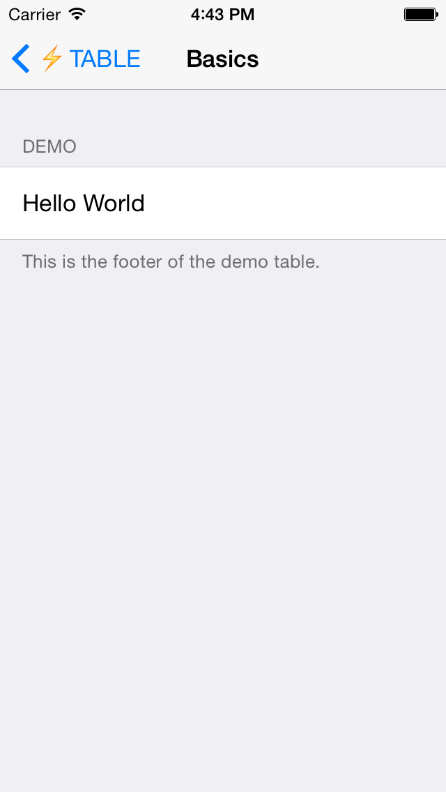

# ⚡️ Lightning Table
## Lightning Table provides a powerful declarative API for working with UITableView's. 

Table views are the foundation of almost every iOS application, but they're also one of the trickiest controls to master. `UITableView`'s out of the box are driven using an imperative API using the table's data source and delegate protocol. Whilst infinitely extensible, this design pattern can quickly become hard to manage and out of control for more ambitious table views. 

## Basic Example

Take the basic table view pictured below.



### Imperative API (Apple's)

Creating this table view using Apple's API looks a little like this:

```objective-c
- (void)viewDidLoad
{
    [super viewDidLoad];
    
    self.title = @"Basics";
    
    [self.tableView registerClass:[UITableViewCell class] forCellReuseIdentifier:@"Cell"];
}

- (UITableViewCell *)tableView:(UITableView *)tableView cellForRowAtIndexPath:(NSIndexPath *)indexPath
{
    UITableViewCell *cell = [tableView dequeueReusableCellWithIdentifier:@"Cell" forIndexPath:indexPath];
    
    if (indexPath.row == 0) {
        cell.textLabel.text = @"Hello World";
    }
    
    return cell;
}

- (NSInteger)numberOfSectionsInTableView:(UITableView *)tableView
{
    return 1;
}

- (NSInteger)tableView:(UITableView *)tableView numberOfRowsInSection:(NSInteger)section
{
    return 1;
}

- (void)tableView:(UITableView *)tableView didDeselectRowAtIndexPath:(NSIndexPath *)indexPath
{
    if (indexPath.row == 0) {
        NSLog(@"Excellent choice!");
    }
}

- (NSString *)tableView:(UITableView *)tableView titleForHeaderInSection:(NSInteger)section
{
    return @"Demo";
}

- (NSString *)tableView:(UITableView *)tableView titleForFooterInSection:(NSInteger)section
{
    return @"This is the footer of the demo table.";
}
```

We use a delegate and data source to specify everything, and we need to use indexPath's to check if it is indeed the first row that has been selected.
	
### Declarative API (Lightning Table)

Creating the same table view using Lightning Table looks like this:

```objective-c
- (void)viewDidLoad
{
    [super viewDidLoad];
    
    self.title = @"Basics";
    
    EKTableRow *row = [EKTableRow rowWithTitle:@"Hello World"];
    EKTableSection *section = [EKTableSection sectionWithHeaderTitle:@"Demo" rows:@[row] footerTitle:@"This is the footer of the demo table." selection:^(EKTableRowSelection *selection) {
        NSLog(@"Excellent selection!");
    }];
    
    self.sections = @[section];
}
```
	
As you can see it's far more succinct, requiring dramatically less code. All our table logic is in one place, rather than spread out between multiple method calls, meaning we can quickly deduce what the table views structure will be.

## Lightning Table Protocol 

Whilst you can create concrete instances of `EKTableRow` and `EKTableSection`, Lightning Table's real power comes with its protocol. Making your objects conform to `EKTableRowProtocol` means they can be inserted directly into the table view. 

Take the below example of a Note's object. 

```objective-c
@implementation EKDNote

+ (instancetype)noteWithText:(NSString *)text
{
    EKDNote *note = [EKDNote new];
    note.text = text;
    note.date = [NSDate date];
    note.color = [UIColor yellowColor];
    
    return note;
}

#pragma mark - Row protocol 

- (NSString *)rowTitle
{
    return self.text;
}

- (NSString *)rowSubtitle
{
    return self.date.description;
}

- (void)configureRowCell:(EKTableViewCell *)cell
{
    cell.contentView.backgroundColor = self.color;
}

- (Class)rowCellClass
{
    return [EKDNoteTableViewCell class];
}

@end
```


The object describes how it should be presented in the table view - it specifies the cell title (textLabel), sub title (detailTextLabel) as well what `UITableViewCell` subclass should be used. The object also has the opportunity to perform manual configuration - in this example the object sets the cell background colour. If you've ever used `MKAnnotation` before, this design should be familiar to you.

## Automatic Cell Height Calculation 

Another pain point of working with `UITableView`'s is the need to calculate the cell's height. For basic layouts this is usually a fixed value, but for cells with dynamic text lengths this can an iOS developers worst nightmare.  

Lightning Table automatically calculates the cells height for you by using a "proxy cell" to perform layout calculations. You don't need to do anything special (such as using auto layout), this behaviour is automatic. It's also *lightning* fast. 

If you need to manually specify your cell's height, you still can:

```objective-c
- (CGFloat)rowHeightForConstraintSize:(CGSize)contraintSize;
```

## Getting Started

- Download the project and have a play with the Demo app. 
- Include the LightningTable project in your workspace.
- Add libLightningTable to your build phases.
- Add header search paths.
- Import "LightningTable.h" where appropriate. 
- Use the `EKTableViewController` as your view controller class. 

## Project Status

Think of Lightning Table as an early beta. Whilst it's *good enough* to use in production, there are likely scenarios that I haven't accounted for. In that instance, file an issue or submit a pull request with a fix. 

- Create Unit Tests.
- Improved documentation. 


## Maintainers 

- [Phillip Caudell](http://phillipcaudell.com) [(@phillipcaudell)](http://twitter.com/phillipcaudell)


## License 

Lightning Table is available under the MIT license. See the LICENSE file for more info.